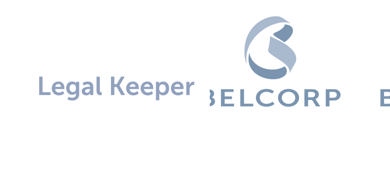

# Legal Keeper - Legal Hackaton Laboratoria-Belcorp 2020

  

This project was created by frontend developers: [Paula P](https://github.com/paula113),  [Alejandra Pérez](https://github.com/alefyp), [Alejandra Ibáñez](https://github.com/marialejandraip),  guided by Eliane as UX designer.

## Index

* [1. Project aim ](#1-project-aim)
* [2. Product](#2-product)
* [3. UX research](#3-UX-research)
* [4. Prototypes](#4-Prototypes)

## 1. project aim
Legal Keeper is a tool that works as a repository of projects evaluated and allows to manage in an efficient way, the risks and the recommendations provided throughout the process.

## 2. Product
Legal Keeper is a legal team network in Belcorp. Legal team attend all projects over 14 contries in the world and need the best way to respond and save information about the projects. Legal keeper includes the resume of analysis and result of legal appraisal for the new projects in Belcorp Company, update every kind of change that will be inside the project in the legal way and share it to the client. 

  

## 3. UX research

## 4. Prototypes

  

  

  

Made it with 💚 
